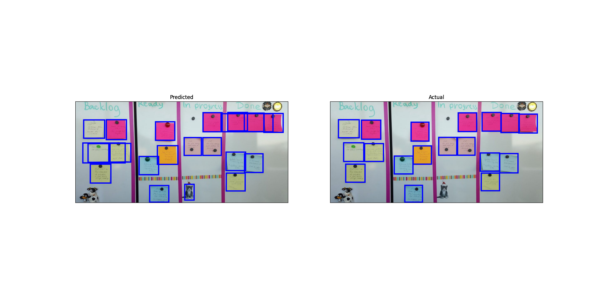

# Post-it segmentation

- Small project to fine-tune PyTorch's `fasterrcnn_resnet50_fpn` to specifically detect and segment images of post-it notes
- Intention to integrate with a handwritten text recognition model / API to create an easy way to transform real life image of post its into a digital task list
- Post-it training data is copied from https://github.com/valtech-uk/sticky-note-reader/tree/master/data

## Performance

### Before fine-tuning

### After fine-tining

