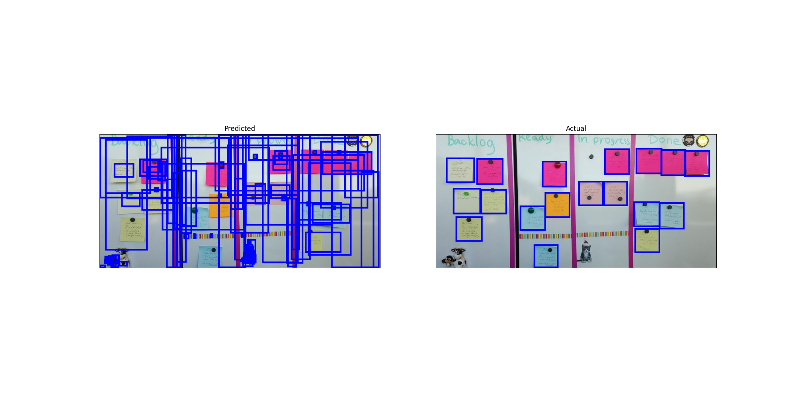
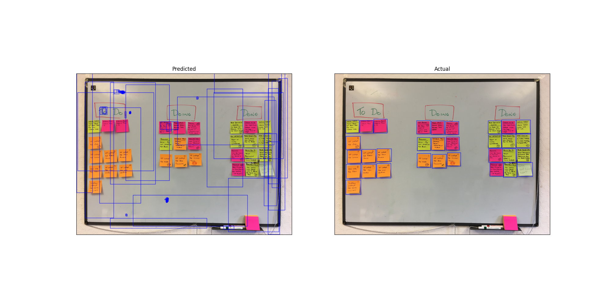
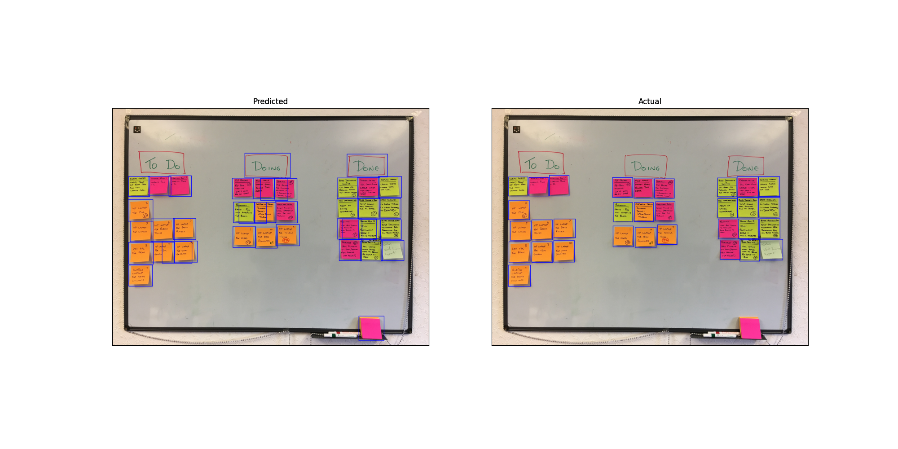

# Post-it segmentation

- Small project to fine-tune PyTorch's `fasterrcnn_resnet50_fpn` to specifically detect and segment images of post-it notes
- `main.py` integrates this with GCPs Cloud Vision API to detect handwritten text in the post its
- TODO: Integrate with Tesseract or other local text recognition model instead of Vision API to enable whole thing to run locally
- Post-it training data is copied from https://github.com/valtech-uk/sticky-note-reader/tree/master/data

## Performance

### Before fine-tuning

### After fine-tuning

